# Architecture — Marketing Data Ingestion & RAG Assistant

**Deliverable:** Architecture diagram — components, data flows, AI integration points

**Companion documents:** [HIGH_LEVEL_DESIGN.md](HIGH_LEVEL_DESIGN.md) (design rationale and tradeoffs), [README.md](README.md) (how to run it)

---

## 0. How to read this document

This document answers three questions, in order, each with a diagram and a table:

| Section | Question it answers |
|---|---|
| §2 System context | What is inside the system, what is outside it, and who talks to whom |
| §3 Component architecture | What the internal building blocks are, and how they are layered |
| §4–§6 Data flows | How data actually moves — the ingestion path, the query path, the scheduled path |
| §7 AI integration points | Exactly where a model is invoked, what it is allowed to decide, and what guards it |
| §8 State & lifecycle | How one unit of work (a job) progresses and settles |
| §9 Security architecture | Where the trust boundary sits and how identity flows through it |
| §10 Production evolution | Which boxes change shape at scale, and which stay |

**One architectural thesis runs through all of it.** The system separates *computation* from *phrasing*, and *suggestion* from *application*:

> Deterministic code computes every fact. AI interprets fuzzy input and phrases facts into English. A human authorises every change to data. No single one of those three ever does another's job.

Every diagram below is annotated to show where that line falls, because the line — not the box diagram — is the actual architecture.

**Figure index.** Twelve diagrams, in order: 1 system context · 2 component architecture · 3–4 ingestion control flow (upload→complete, then review→warehouse) · 5 data transformation · 6 post-approval fan-out · 7 assistant query paths · 8 scheduled ingestion · 9 AI integration points · 10 job lifecycle · 11 security architecture · 12 production evolution.

---

## 1. Architectural style at a glance

| Dimension | Choice |
|---|---|
| Style | Modular monolith — single Node process, strictly layered internally (routes → services → stores) |
| Frontend | React SPA, thin: renders server-computed state, holds no business rules |
| Communication | REST over HTTP; client **polls** for long-running work (no websockets) |
| Concurrency model | Accept-then-process: the upload endpoint returns `202` immediately, work continues on the event loop |
| Coupling to externals | Every external dependency (LLM, vector store, ad platform, warehouse) is reached only through a dedicated service module — never from a route, never from the browser |
| State | In-memory stores behind a module interface, deliberately swappable for a database (see §10) |
| Failure posture | Critical path fails loudly; non-critical side effects fail in isolation without failing the job |

---

## 2. System context

Who and what sits outside the system, and every line that crosses the boundary.

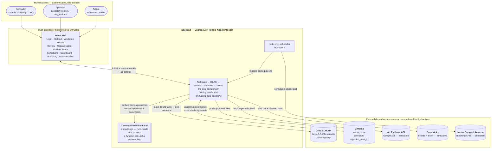

### Boundary contract

| Crossing | Direction | Why it is shaped this way |
|---|---|---|
| Browser → API | REST + `httpOnly` session cookie | The token is never readable by page JavaScript, so one XSS bug is not a session-theft bug |
| Browser → any external | **Does not exist** | No API key ever reaches the client; every AI call is subject to the same server-side grounding discipline regardless of which screen triggered it |
| API → Groq | Outbound only, per job / per query | Groq never initiates; a Groq outage degrades phrasing, not correctness |
| API → Xenova | **In-process function call, not a network call** | Shapes a real design decision: embedding is CPU-bound and sequential, so `matchAllCampaigns` deliberately does *not* `Promise.all` — there is no network latency to overlap |
| API → Chroma | Read/write, fire-and-forget on write | A Chroma outage loses searchability of that run, never the run itself |
| Cron → pipeline | Internal | A scheduled run and a manual upload converge on the identical code path, so there is exactly one ingestion implementation to reason about |

---

## 3. Component architecture

Five layers. A dependency arrow never points upward.

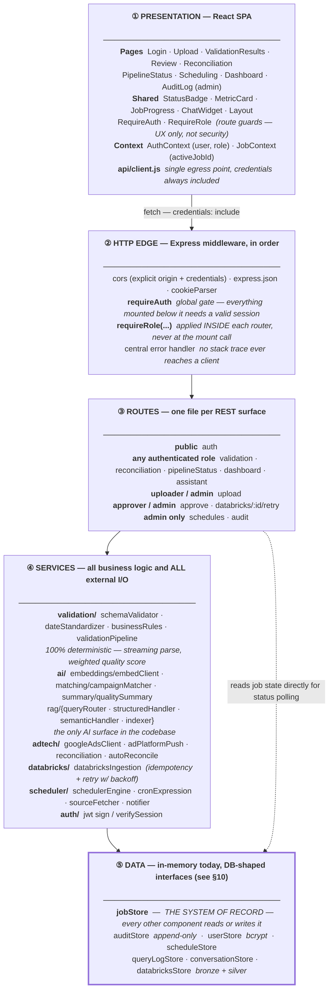

### Component inventory

| # | Component | Responsibility | Deterministic? | Key files |
|---|---|---|---|---|
| 1 | **Validation pipeline** | Streams CSV rows; validates headers, schema, enums; standardises dates; applies business-rule corrections; detects duplicates; computes a weighted quality score | ✅ Fully | `services/validation/*` |
| 2 | **AI campaign matcher** | Embeds an uploaded campaign name, cosine-compares against a cached master list, returns `suggest` or `flag_for_review` | ⚠️ AI-scored, deterministically thresholded | `services/ai/matching/*` |
| 3 | **AI quality summary** | Converts a fixed JSON fact object into one plain-English sentence | ❌ LLM phrasing | `services/ai/summary/qualitySummary.js` |
| 4 | **RAG assistant** | Routes a question to an exact-computation path or a vector-retrieval path; both are LLM-phrased with citations | ⚠️ Routing + retrieval deterministic; phrasing is not | `routes/assistant.js`, `services/ai/rag/*` |
| 5 | **Review & approval** | Records a per-suggestion human decision — the single event that unlocks all downstream writes | ✅ Fully | `routes/approve.js` |
| 6 | **Ad platform push** | Pushes approved campaign performance data back to the ad platform (simulated transport) | ✅ Fully | `services/adtech/adPlatformPush.js` |
| 7 | **Spend reconciliation** | Compares uploaded vs. platform-reported spend per campaign; flags variance > 5% | ✅ Fully | `services/adtech/reconciliation.js`, `autoReconcile.js` |
| 8 | **Databricks ingestion** | Lands raw + cleaned rows into simulated bronze/silver tables with an idempotency key and retry-with-backoff | ✅ Fully | `services/databricks/databricksIngestion.js` |
| 9 | **Scheduler** | Per-source cron config; triggers the same pipeline programmatically; records run history; notifies on terminal failure | ✅ Fully | `services/scheduler/*` |
| 10 | **Dashboard aggregation** | Totals, quality trend, reconciliation pass rate, AI suggestion acceptance rate, RAG query stats, pipeline latency | ✅ Fully | `routes/dashboard.js` |
| 11 | **Job store** | The system of record for a run: status, validation results, matches, decisions, push/ingestion/reconciliation outcomes | ✅ Fully | `data/jobStore.js` |
| 12 | **Auth & RBAC** | Login, bcrypt verification, JWT signing, session verification, three-role enforcement | ✅ Fully | `routes/auth.js`, `middleware/auth.js`, `services/auth/jwt.js` |
| 13 | **Audit log** | Append-only record of every mutation, actor always derived from the verified session | ✅ Fully | `data/auditStore.js`, `routes/audit.js` |

**Two structural notes worth stating explicitly:**

1. **`jobStore` is the integration hub, and that is intentional.** Validation, matching, approval, push, ingestion, reconciliation, RAG indexing, and the dashboard all converge on one record rather than passing payloads between each other. This is why independently-timed processes can write to the same run without coordinating: they occupy different *fields* (`status`, `pushStatus`, `ingestionStatus`, `reconciliation`) of the same object. A job **accumulates** state; it never replaces it.
2. **RBAC is applied inside each router, not at the mount call.** `app.use('/', middleware, router)` would run `middleware` for every request reaching that line — the mount path `'/'` matches everything as a prefix, not just routes that exist inside the router. Gating with `router.use(requireRole(...))` avoids accidentally 403-ing unrelated routes.

---

## 4. Data flow — the ingestion path (primary flow)

### 4.1 Control flow, part 1 — upload to `status: complete`

Everything in this first half determines the user's "is my upload done" signal.

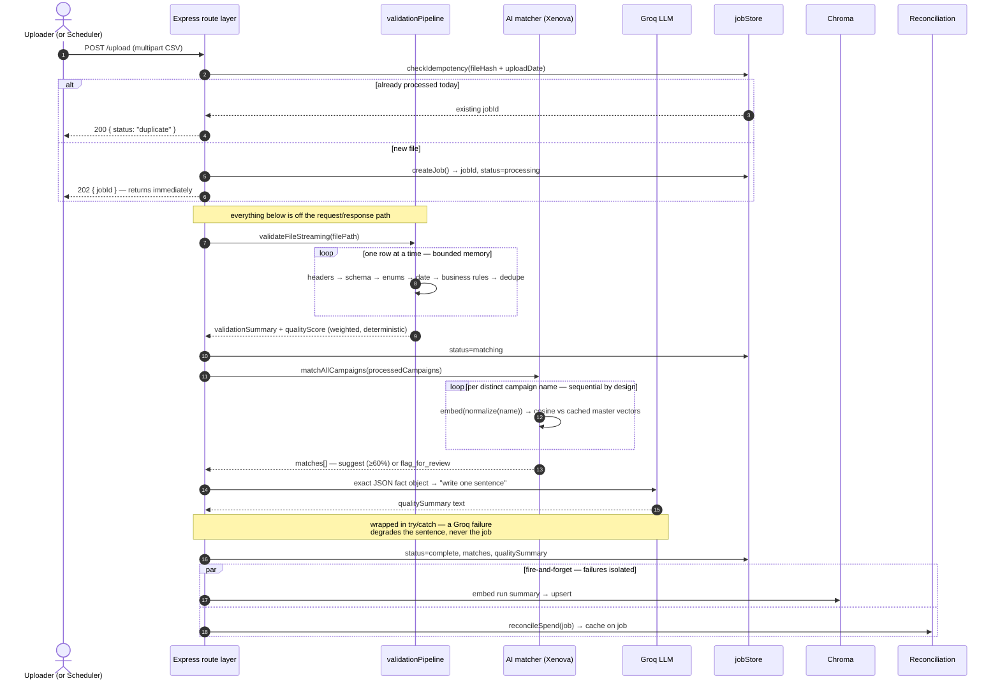

### 4.2 Control flow, part 2 — review to warehouse write

The human gate, and the two writes it unlocks.

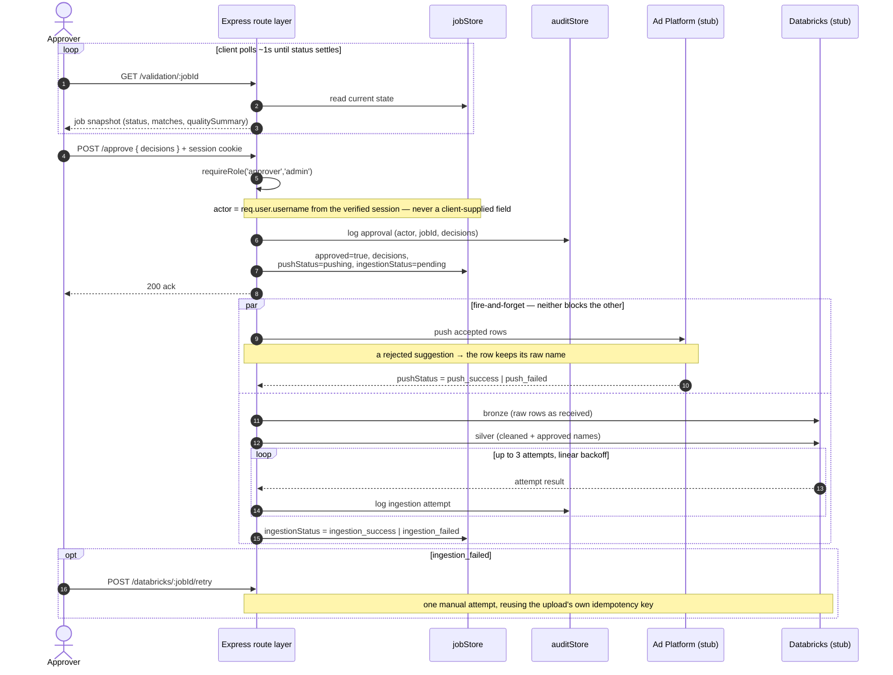

### 4.3 Data transformation flow — what the payload *is* at each hop

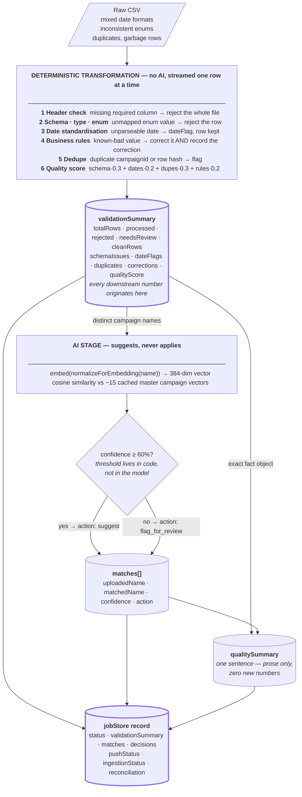

Two things are true of every number that reaches the Validation Results screen: it was computed inside the grey deterministic block, and it travelled there through `validationSummary`. The AI stage contributes *suggestions* and *prose* to the job record — never a figure.

### 4.4 Post-approval fan-out — what the approval decision unlocks

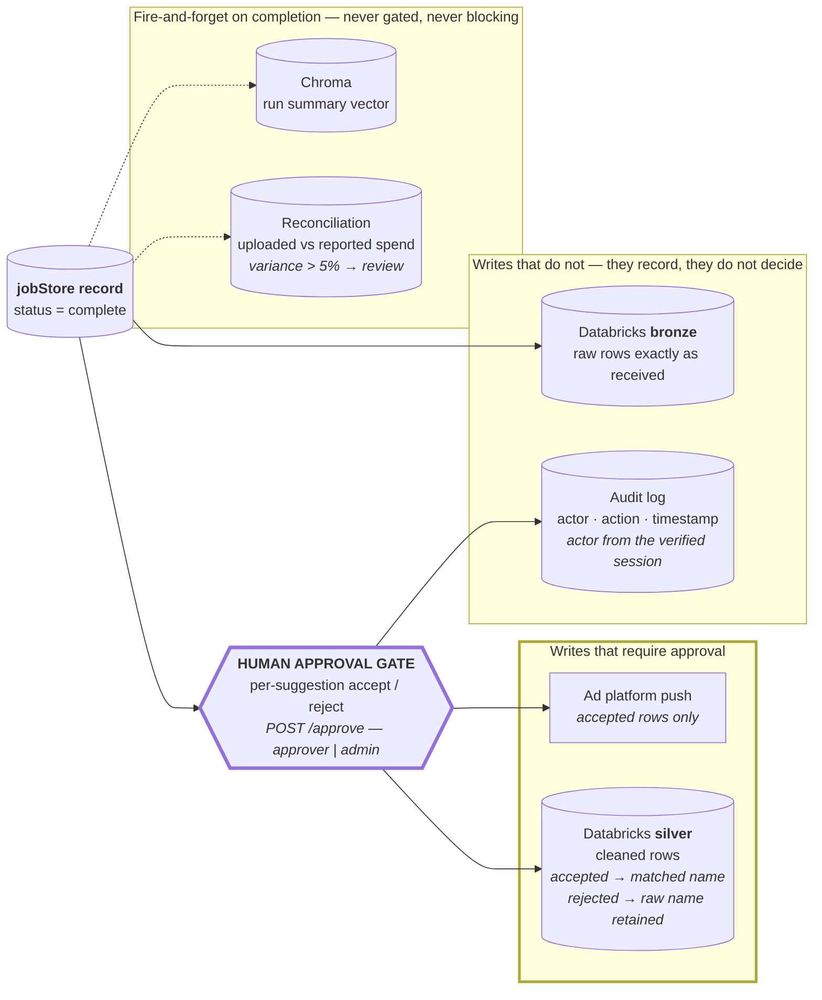

**Bronze is deliberately not gated.** The raw table records what arrived, which is a fact independent of anyone's judgement; silver records what the organisation decided the data means, which is not. Separating them is what makes a rejected suggestion recoverable — the original name is still sitting in bronze — rather than lost.

### 4.5 Flow inventory

Every data flow in the system, with its transport, timing, and failure behaviour.

| Flow | Trigger | Payload | Sync? | On failure |
|---|---|---|---|---|
| Upload → job created | `POST /upload` | multipart CSV → `{jobId}` | Sync (`202` in ms) | 400 on missing file; duplicate returns the existing job |
| Validation | Job kickoff | file stream → `validationSummary` | Async, awaited in `runJob` | `status=failed`, error stored on the job — **critical path** |
| Campaign matching | After validation | campaign names → `matches[]` | Async, awaited, sequential per name | `status=failed` — **critical path** |
| Quality summary | After matching | fact JSON → one sentence | Async, awaited, **try/catch'd** | Job still reaches `complete` without the sentence — *not* critical path |
| Status polling | Client, ~1s | — → job snapshot | Sync read | Client retries on next tick |
| RAG indexing | Job `complete` | run summary → vector upsert | **Fire-and-forget** | Logged; run is un-searchable but intact |
| Auto-reconciliation | Job `complete` | job + platform spend → variance rows | **Fire-and-forget** | Logged; reconciliation page shows nothing for that run |
| Approval | `POST /approve` | `{decisions}` + session cookie | Sync ack | 403 on wrong role; audit entry written either way |
| Ad platform push | Approval | accepted rows → platform | **Fire-and-forget** | `pushStatus=push_failed`; job stays approved |
| Databricks ingestion | Approval | raw + cleaned rows | **Fire-and-forget**, 3 auto attempts w/ linear backoff | `ingestion_failed`; one manual retry available; every attempt audited |
| Assistant query | `POST /assistant/query` | question → answer + citations | Sync | Error surfaced in chat; query logged |
| Scheduled pull | cron tick | source fetch → same pipeline | Async | Run history records failure; `notify` fires |

**The design rule visible in that table:** exactly three flows are on the critical path — validation, matching, and the quality-summary attempt. Those three define `status: complete`, which is the user's "is my upload done" signal. Everything else is a *consequence* of a completed run rather than a *precondition* for reporting one, so nothing else is allowed to block it. RAG indexing, reconciliation, the push, and the warehouse write can each fail independently without failing the upload.

---

## 5. Data flow — the assistant query path

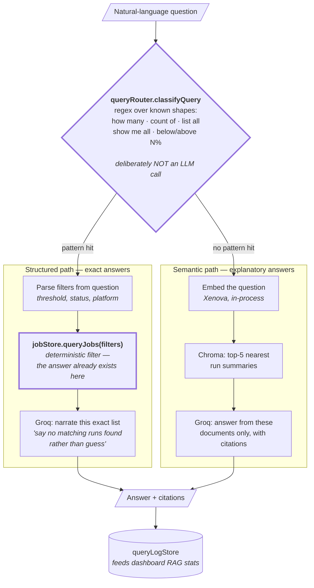

**Why routing is a regex and not a model.** There are a small number of known question shapes, a wrong route is cheap to fix with one more pattern, and an LLM router would add latency, cost, and non-determinism to a decision that has a mechanically correct answer. This is the same "AI only where it adds value" boundary from §7, applied one layer further up the stack.

**Why the structured path computes before it phrases.** `queryJobs()` produces the exact filtered result *first*. The LLM receives a finished answer and is asked only to read it out. It is structurally unable to miscount, because it was never asked to count — the failure mode of "confidently wrong number" is designed out rather than prompted against.

---

## 6. Data flow — the scheduled path

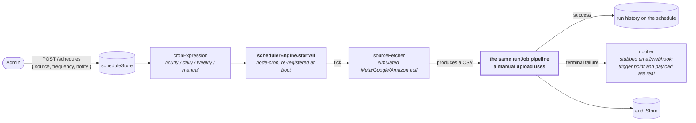

**One pipeline, two entry points.** A scheduled run and a manual upload converge on the identical code, so validation, matching, grounding, approval, and audit behave the same either way. There is no second implementation to keep in sync.

**The sharpest edge in the current design is here.** `node-cron` runs in-process with no leader election. If the API tier ever runs more than one instance, every instance fires the same cron and the same source is processed two or three times. This must be solved *before* horizontal scaling, not after — see §10.

---

## 7. AI integration points

### 7.1 The AI surface, in full

Six integration points, drawn as six independent chains. Read each row left to right: **deterministic input → what the model does → what constrains it → where the output lands.** The zone colouring is consistent across all six — 🔒 deterministic, 🤖 AI, 👤 human, ▣ destination.

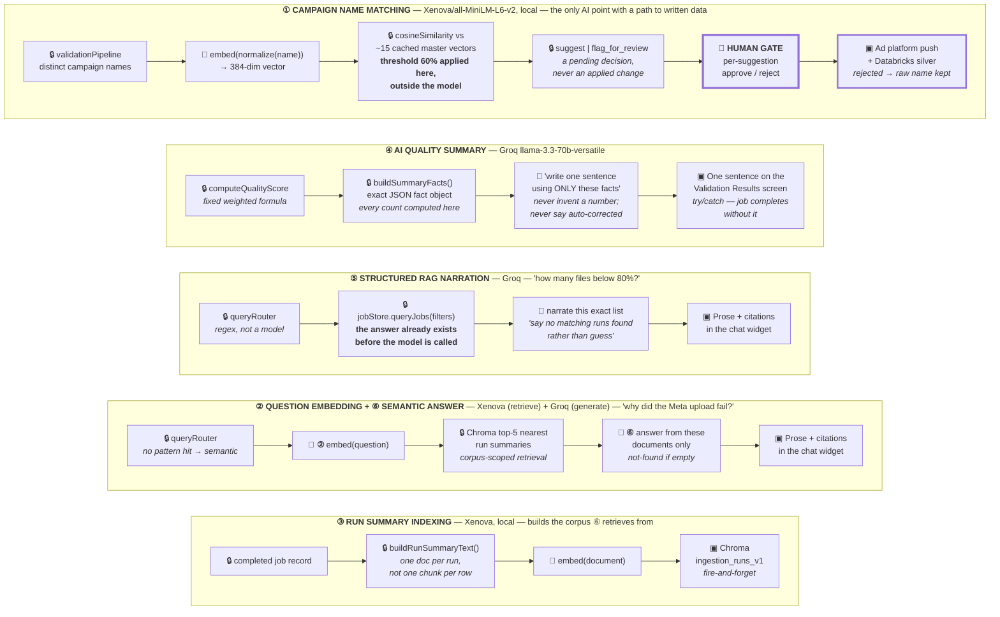

**The shape of that diagram is the point.** Only *one* of the six integration points has any path to written data — ① campaign matching — and that path is interrupted by a human gate before it reaches either destination. The other five terminate in text on a screen or in a search index. There is no arrow anywhere in this system from a model directly into a data write.

**Note the deliberate asymmetry in each row:** the 🔒 boxes always bracket the 🤖 box. Every AI step receives already-computed input and hands its output to something that constrains it — a threshold, a citation requirement, a human, or a screen. The model is never at either end of a chain.

### 7.2 Integration point reference

| # | Integration point | Model | Input | Output | What it may decide | Grounding guard | Failure mode |
|---|---|---|---|---|---|---|---|
| ① | **Campaign name matching** | `Xenova/all-MiniLM-L6-v2`, local | Normalized uploaded name | 384-dim vector → cosine score vs ~15 cached master vectors | *Nothing.* It produces a similarity score; deterministic code applies the 60% threshold and a human applies the decision | Never auto-applies. `suggest` and `flag_for_review` are both pending human decisions. A rejected suggestion carries the raw name all the way into the silver table | Model load failure fails the job (critical path). A bad score produces a wrong *suggestion*, never a wrong *write* |
| ② | **Question embedding** | Same, local | User question | Query vector | Nothing — retrieval only | Retrieval is scoped to one collection of run summaries; nothing outside the corpus can be returned | Empty/failed retrieval → "no matching runs found" |
| ③ | **Run summary indexing** | Same, local | Completed job record | Vector + document in `ingestion_runs_v1` | Nothing | One summary document per run, not one chunk per row — row-level detail belongs to the structured path, so the semantic path cannot be asked to do arithmetic | Fire-and-forget; run is un-searchable but intact |
| ④ | **AI quality summary** | Groq `llama-3.3-70b-versatile` | An exact JSON fact object (`qualityScore`, `totalRows`, `rejectedRows`, `fieldCorrections`, `unrecognizedValues`, `dateFlagCount`, `duplicateCount`, `suggestedCampaignMatches`, `flaggedCampaignMatches`) | One plain sentence | Only *wording* | Prompt forbids inventing any number, field, or count; forbids mentioning zero-count categories; requires ending with the exact unchanged score; **explicitly forbids calling a suggested match "auto-corrected"** because the matcher never applies one | `try/catch` — the job completes without a summary sentence |
| ⑤ | **Structured RAG narration** | Groq | An already-filtered exact result set from `queryJobs()` | Prose + citations | Only wording | The answer is computed before the model is called. Instructed to say "no matching runs found" rather than speculate | Error surfaced in chat |
| ⑥ | **Semantic RAG answer** | Groq (+ Xenova for retrieval) | Top-5 retrieved run summaries | Prose + citations | Only wording and which retrieved evidence to cite | Classic retrieve-then-generate: answer only from supplied documents, say not-found if empty | Error surfaced in chat |
| — | **Query routing** | **None — regex** | Question text | `structured` \| `semantic` | — | Routing has a mechanically correct answer for the known question shapes; a model here would add cost and non-determinism for no accuracy gain | A miss routes to semantic, which still answers |

### 7.3 The four guards, stated as invariants

These are the properties that make the AI trustworthy in this system. Each is enforced structurally, not by prompt wording alone.

1. **Compute-then-phrase.** Every number the LLM emits was computed by deterministic code before the model was invoked. The model is handed a finished fact object and asked for a sentence. It cannot miscount because it is never asked to count.
2. **Suggest-never-apply.** The matcher's output is always a pending decision. The human gate sits between the AI suggestion and *both* downstream writes — the ad-platform push and the silver table's campaign names. A rejected suggestion is not merely ignored; the raw name is deliberately preserved end-to-end.
3. **Threshold outside the model.** The AI produces a continuous score; deterministic code turns it into `suggest` / `flag_for_review` at 60%. Tuning behaviour means changing one constant, not re-prompting a model.
4. **Fail-open on phrasing, fail-closed on facts.** A Groq outage removes a sentence. It never removes, delays, or corrupts a validated row. Conversely, a validation failure stops the run outright.

> **The one-line summary of the AI boundary:** *AI decides what a fact probably means, or how to phrase a fact into English. It never decides what the fact is, and it never applies a change unsupervised.*

### 7.4 Two things worth flagging honestly

- **The 60% threshold is a judgment call, not a derived number.** The brief supplies only widely-spaced reference points (94/91/97% → suggest, 12% → flag). In production this would be tuned against a labelled sample of real mismatches. Note also that the explanatory comment above `SUGGEST_THRESHOLD` in `services/ai/matching/campaignMatcher.js` still discusses *70%* while the constant is `0.60` — the comment is stale relative to the code and should be reconciled.
- **Embedding versioning is deliberate but incomplete.** `embedClient` exports `modelName`, `modelVersion`, `normalizationVersion`, and `embeddingSchemaVersion`, and the Chroma collection is named `ingestion_runs_v1`, so changing the model means creating a new versioned collection and re-embedding rather than silently mixing vectors from two pipelines. The versioning *metadata* exists; the *migration job* that would use it does not yet.

---

## 8. State & lifecycle

A job accumulates independent, differently-timed state on one record.

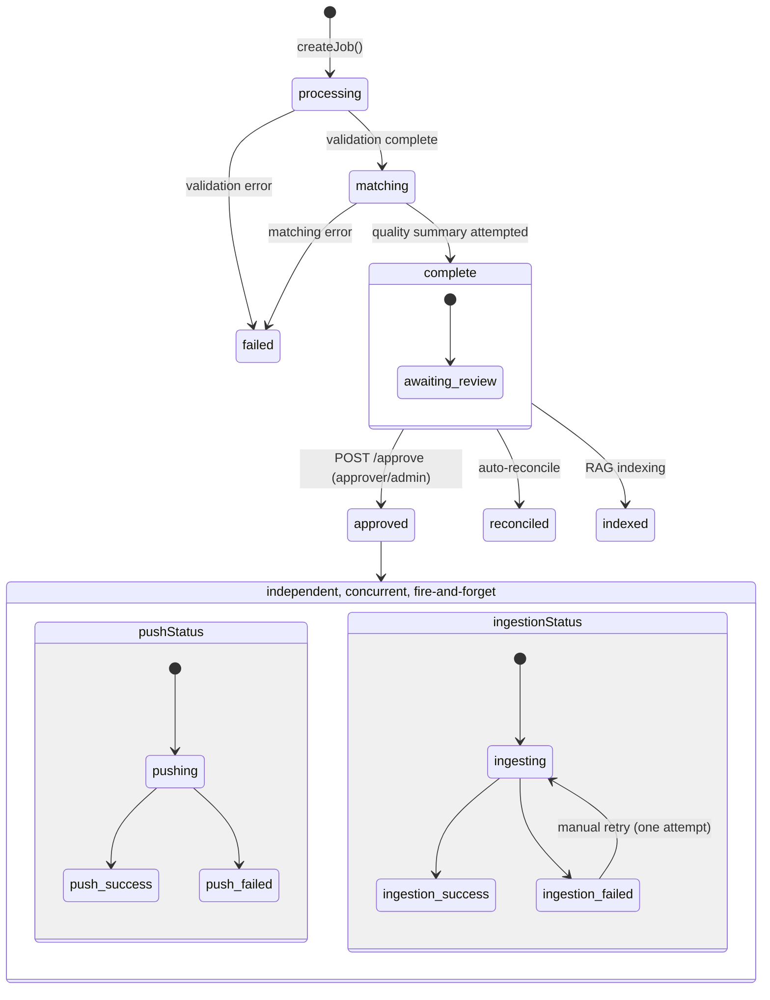

**Why the frontend runs three separate polling loops** (`pollJob`, `pollPushStatus`, `pollIngestionStatus`) rather than one: `status`, `pushStatus`, and `ingestionStatus` are independent fields settling at independent times. A single loop would either poll too aggressively for the slow field or report the fast one late.

**Idempotency is proven end-to-end, not just at the edge.** `fileHash + uploadDate` deduplicates the upload *and* is reused as the Databricks ingestion idempotency key — the same concept holds at both ends of the pipeline, so the pattern is validated rather than asserted.

---

## 9. Security architecture

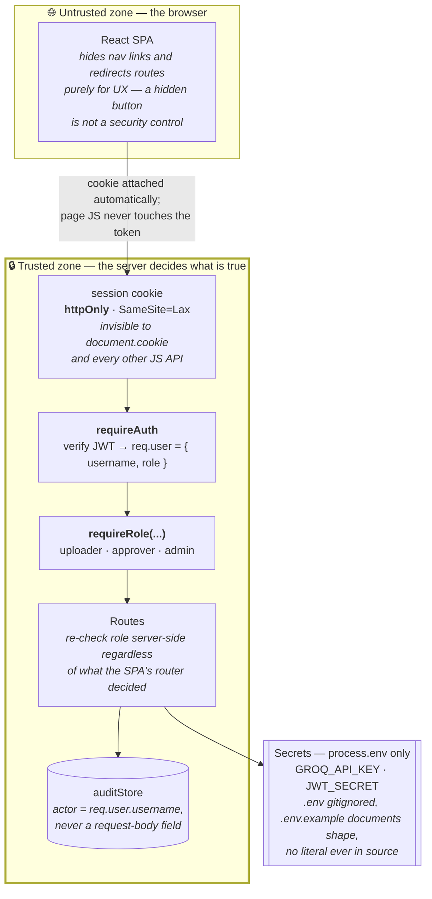

| Control | Decision | Why this way |
|---|---|---|
| Session transport | `httpOnly` cookie, **not** `localStorage` | A token in `localStorage` is readable by any script on the page, including a compromised third-party dependency — one XSS becomes full session theft. An `httpOnly` cookie is unreachable from JS entirely |
| CSRF | `SameSite=Lax`, no separate token | `localhost:5173` and `:3000` are same-site (SameSite compares registrable domain, not port), so the SPA's own fetches carry the cookie — but Lax refuses to attach it to a cross-site state-changing request, which is exactly the CSRF request shape. A double-submit token becomes worthwhile only if the SPA and API move to genuinely different sites |
| Passwords | bcrypt hashed, never compared in plaintext | Accounts are seeded demo users rather than self-registered — a prototype shortcut on *provisioning*, deliberately not on *storage* |
| JWT secret | `process.env.JWT_SECRET`; if unset, a random per-process secret plus a loud warning | The failure mode is safe (sessions reset on restart) rather than silent (signing with a secret anyone reading the source also knows) |
| Audit actor | Always `req.user.username` | Both `/approve` and the Databricks retry endpoint previously accepted a free-text `reviewer` field and logged *that* — trivially spoofable. An audit log that trusts client input for "who did this" is not an audit log |

### Role → route matrix

| Route(s) | Role | Rationale |
|---|---|---|
| `POST /auth/login` | public | must be reachable while logged out |
| `GET /validation`, `/reconciliation`, `/pipeline-status`, `/dashboard`, `POST /assistant/query` | any authenticated | read-only visibility; every role needs run history to do its part |
| `POST /upload` | uploader, admin | only these roles start a new run |
| `POST /approve`, `POST /databricks/:id/retry` | approver, admin | the "commits changes" surface |
| `/schedules*`, `GET /audit` | admin | operational and administrative concerns |

**Known gap, stated rather than hidden:** job visibility is **role-based, not ownership-based**. A job record has no `uploadedBy` field and `GET /validation/:jobId` has no ownership check beyond `requireAuth`, so any authenticated role can view any job by ID and any approver can approve any job. That is intentional — approval is a role capability, not an ownership one — but it also means there is no "my uploads" filter and no per-job access control today. Relatedly, cross-session handoff from uploader to approver currently rides on `sessionStorage.activeJobId`, which survives a logout/login in the same browser tab but not a new tab or device. The production replacement is a durable jobs table queried by a real pending-review endpoint (`GET /jobs?status=complete&approved=false`).

---

## 10. Production evolution — which boxes change shape

Same logical architecture, different physical one. The dashed boxes are what a production deployment adds.

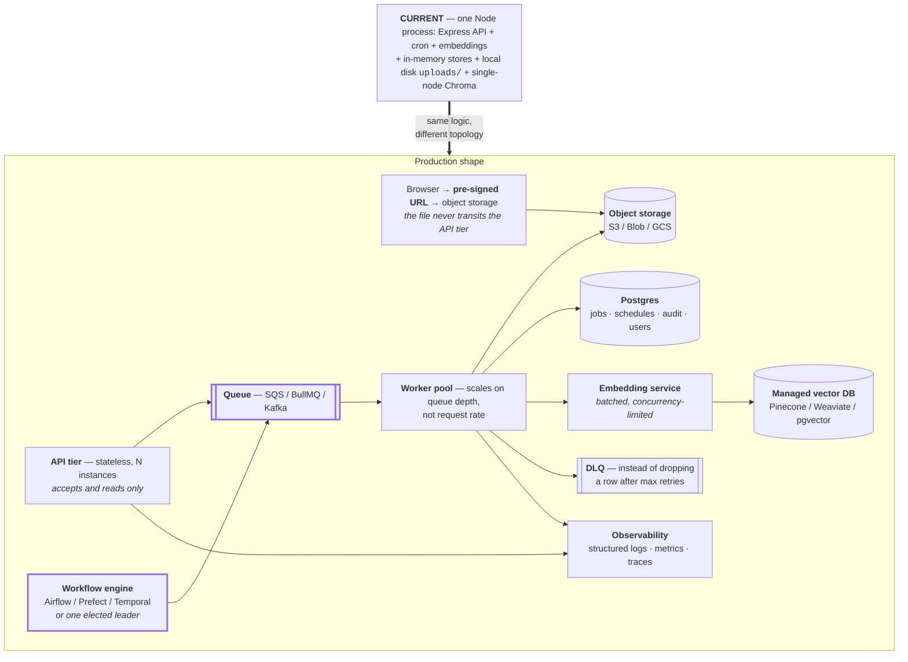

| Concern | Current | Production | Why it matters at scale |
|---|---|---|---|
| **Scheduler** ⚠️ | `node-cron` in-process | Workflow engine, or one elected leader | **Blocking issue for horizontal scaling.** Every instance would independently fire the same cron and double-process the same source. `node-cron` has no leader election — this must be solved *before* adding instances |
| Job/schedule/audit state | In-memory `Map`s | Postgres (Redis for hot state) | Instance B cannot see a job instance A created. This alone blocks multi-instance deployment |
| File storage | Local disk, deleted after processing | Object storage + pre-signed browser upload | Local disk ties processing to one instance and does not survive that instance dying mid-job |
| Upload processing | `runJob()` on the same process that took the request | Queue + separate worker pool | Decouples "accept the file" from "process the file"; workers scale on queue depth |
| CSV validation | Streaming, one row at a time | **Same pattern** — a worker streams from object storage | The streaming approach is already right; only *where* it runs changes |
| Campaign matching | Brute-force cosine over ~15 in-memory vectors | ANN index (HNSW/FAISS), or move into the vector DB | O(n) is free at n=15 and a real cost at n=10,000+ |
| Embeddings | Local model, sequential, CPU-bound | Dedicated batched embedding service with a concurrency limit | Sequential is correct for a local model (no network latency to overlap); a hosted API inverts that calculus entirely |
| Vector store | Single-node Chroma | Managed/replicated vector DB | No HA and no read scaling as history grows |
| LLM calls | One synchronous call per job/query | Request queuing, streamed responses, cost monitoring, prompt caching | Stops one slow call stalling the pipeline; puts a ceiling on cost |
| Push / warehouse write | Simulated, deterministic retry | Real async polling + DLQ, same idempotency key | The retry-with-backoff *pattern* is already production-shaped; only the transport is fake |
| Audit log | In-memory append-only array | Durable, immutable, tamper-evident table | An in-memory array satisfies neither compliance requirement |
| Secrets | `.env` + `dotenv` | Vault / AWS Secrets Manager / platform injection | Fine for local dev, not for a deployed multi-person environment |
| Observability | `console.log` + dashboard-derived health | Structured logging, metrics, tracing | The dashboard's pipeline-health numbers come from job records, not real instrumentation |

---

## 11. Build status

| Area | Status |
|---|---|
| Ingestion, validation, campaign matching, RAG assistant, AI quality summary | ✅ Fully built and wired end-to-end |
| Review approve/reject → ad platform push → Databricks ingestion → audit trail | ✅ Fully built; transport layers simulated and documented per-file |
| Scheduling | ✅ Fully built — config, cron execution, run history, failure notification. The *source fetch* is the one simulated piece (no real platform credentials) |
| Dashboard | ✅ Fully built, aggregating real job-store / query-log / reconciliation data |
| Auth & RBAC | ✅ Fully built — login, httpOnly-cookie sessions, three roles enforced server-side. Seeded demo accounts rather than SSO is the one deliberate shortcut |
| Secrets management | ⚠️ `.env` + `.env.example` + `.gitignore`, nothing hardcoded — real practice for a prototype, not a secrets manager |
| Observability | ❌ No structured logging, metrics, or tracing beyond `console.*` |
| Multi-instance safety | ❌ In-memory state and in-process cron both assume exactly one backend process |

---

## 12. Appendix — repository map

```
backend/
  app.js                          — app wiring: CORS, cookies, auth gate, route mounting, scheduler boot
  middleware/auth.js              — requireAuth (session verification), requireRole (RBAC)
  data/                           — jobStore · auditStore · scheduleStore · userStore
                                     queryLogStore · conversationStore · databricksStore
  routes/                         — auth · upload · validation · approve · reconciliation
                                     databricks · schedules · dashboard · assistant
                                     pipelineStatus · audit
  services/
    auth/jwt.js                   — sign / verifySession
    validation/                   — schemaValidator · dateStandardizer · businessRules
                                     validationPipeline (streaming + weighted quality score)
    ai/embeddings/embedClient.js  — shared local embedder + version metadata
    ai/matching/                  — campaignMatcher · cosineSimilarity
                                     masterCampaignList · normalizeForEmbedding · matchAllCampaigns
    ai/summary/qualitySummary.js  — fact object → one sentence (Groq)
    ai/rag/                       — queryRouter · structuredHandler · semanticHandler · indexer
    adtech/                       — googleAdsClient · adPlatformPush · reconciliation · autoReconcile
    databricks/                   — databricksIngestion (idempotency + retry w/ backoff)
    scheduler/                    — schedulerEngine · cronExpression · sourceFetcher · notifier
  test/                           — adPlatformPush · campaignMatcher · databricksIngestion
                                     embedVersioning · reconciliation · uploadRoute

frontend/
  src/pages/                      — Login → Upload → ValidationResults → Review →
                                     Reconciliation → PipelineStatus → Scheduling →
                                     Dashboard, plus admin-only AuditLog
  src/components/                 — StatusBadge · MetricCard · JobProgress · ChatWidget
                                     Layout · PreviewNotice · RequireAuth · RequireRole
  src/api/client.js               — every backend call in one place (credentials always included)
  src/context/JobContext.jsx      — active jobId, shared across pages
  src/context/AuthContext.jsx     — current user/role, login() / logout()
```

**Reading this alongside the code:** nearly every file referenced above carries its own "why" as a comment at the point of the decision. This document is the map; the comments are the territory. Where the two disagree, trust the code comment — it is closer to what shipped — and treat the mismatch as something to reconcile (§7.4 names one such case).
