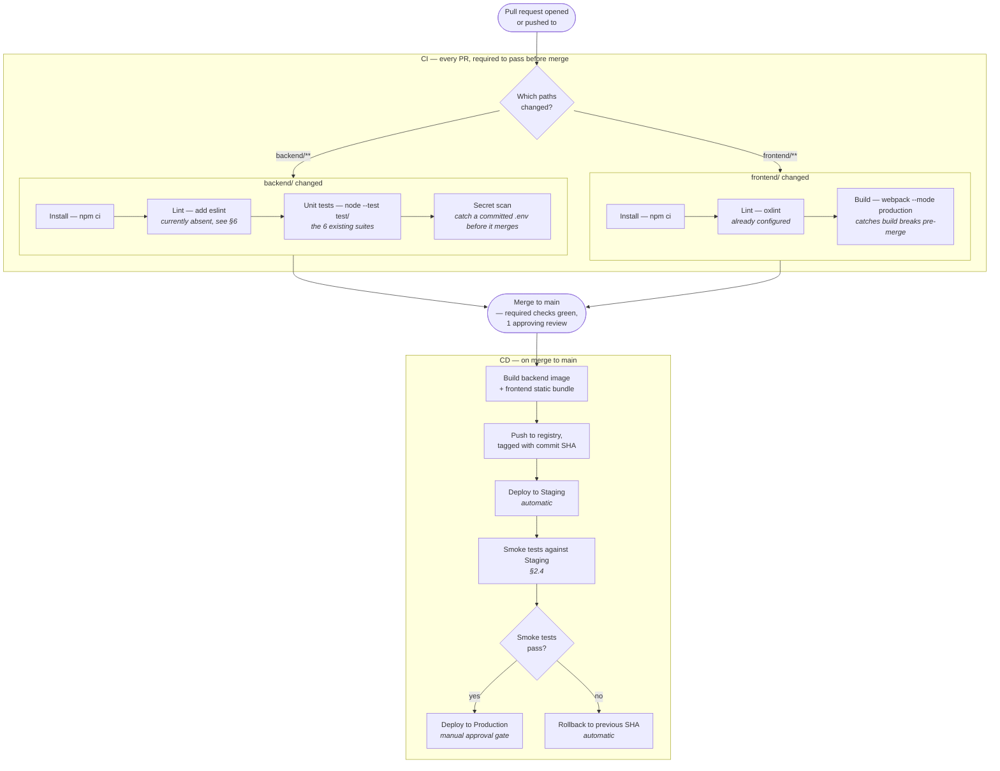
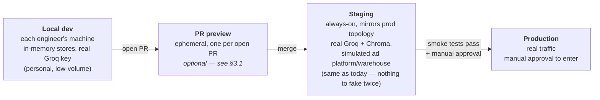

# CI/CD Strategy

**Deliverable:** CI/CD strategy — written design (with pipeline diagrams)
**Companion documents:** [SCALABILITY_RELIABILITY.md](SCALABILITY_RELIABILITY.md) (the production infra this pipeline would deploy to), [TRADEOFFS.md](TRADEOFFS.md) (why some of this is proposed rather than built), [ARCHITECTURE.md](ARCHITECTURE.md) (system this pipeline ships)

---

## 0. Status, stated up front

**No CI/CD exists in this repository today** — there's no `.github/workflows/`, no pipeline config of any kind. This document is the design for what should exist, not a description of something already running. That's worth saying plainly rather than implying otherwise, and it's also why §1.1 below opens with a real, concrete gap this pipeline would immediately need to close: `backend/package.json`'s `test` script is currently a stub (`echo "Error: no test specified" && exit 1`) even though six real `node:test` suites already exist under `backend/test/` — meaning today, `npm test` fails by design and never actually runs the tests that exist. Any CI design has to start from what's really in the repo, not an idealized version of it.

---

## 1. What actually needs to happen, and why this repo's shape matters

This is a two-package monorepo (`backend/`, `frontend/`) with no shared build tooling between them — Node/Express on one side, a webpack-built React SPA on the other. That shape drives two decisions that show up throughout this design:

- **The two packages build, test, and deploy independently.** A frontend-only change (copy, styling, a new page) has no reason to wait on a backend Node test suite, and vice versa. Path-based triggering (§2.2) exists specifically to avoid coupling their pipelines.
- **The backend owns every external dependency** — Groq, Chroma, the (simulated) ad platform, the (simulated) warehouse. The frontend owns none. This means the backend's CI needs real secrets and the frontend's does not, which shapes the secrets-scoping design in §5.

### 1.1 The concrete, current gap

```json
// backend/package.json — today
"scripts": { "test": "echo \"Error: no test specified\" && exit 1" }
```

Six real suites already exist (`adPlatformPush.test.js`, `campaignMatcher.test.js`, `databricksIngestion.test.js`, `embedVersioning.test.js`, `reconciliation.test.js`, `uploadRoute.test.js`), written against Node's built-in `node:test` module — no external test framework dependency needed. The fix is a one-line change:

```json
"scripts": { "test": "node --test test/" }
```

This is listed first because it's a precondition for everything else in this document: a CI pipeline that runs `npm test` today would get a false failure that has nothing to do with the code being tested. Any CI rollout has to fix this in the same PR that introduces the pipeline, not after.

---

## 2. Pipeline stages

### 2.1 Diagram — pull request through production



### 2.2 Why path-based triggering, specifically

Given the monorepo shape from §1, running the full pipeline (backend tests *and* frontend build) on every PR regardless of what changed wastes CI minutes and — more importantly — creates noise that trains reviewers to ignore failing checks ("oh, that's just the unrelated frontend build, ignore it"). Scoping each job to `backend/**` or `frontend/**` path filters means a PR that only touches `frontend/src/pages/DashboardPage.jsx` never spins up a Node test job that has nothing to do with the change, and its CI feedback comes back faster because there's less work queued ahead of the part that actually matters.

### 2.3 What "required to pass before merge" actually enforces

This is a branch-protection setting on `main`, not something the pipeline config itself does — every job listed under §2.1's "Gate" box becomes a required status check, meaning GitHub (or whichever host) refuses to allow a merge until all of them report success. Paired with a required approving review, this is what makes the CI gate a real gate rather than an FYI: a red check blocks the merge button, it doesn't just leave a comment.

### 2.4 Smoke tests, not the full suite, against Staging

The distinction matters: CI's unit tests (§2.1, `BE`/`FE` boxes) run against the code in isolation, with Groq/Chroma/the ad platform either mocked or not exercised at all. Staging smoke tests are a small, fast set of real end-to-end checks against the actually-deployed staging environment — "can I log in," "does an upload return a `jobId`," "does the assistant answer a basic question" — confirming the deployed artifact actually boots and talks to its real (staging) dependencies, which unit tests structurally cannot verify. Keeping this suite small is deliberate: it runs on every merge to `main`, so it needs to complete in well under a minute, not re-run the full validation-pipeline test matrix.

---

## 3. Environments



### 3.1 PR preview environments — optional, not load-bearing

An ephemeral environment per open PR (spun up on PR open, torn down on close/merge) is genuinely useful for reviewing frontend changes visually without pulling the branch locally — but it's listed as optional because it requires either a paid preview-hosting service or meaningful in-house infrastructure (dynamic subdomain routing, ephemeral database provisioning) that isn't justified until the team is large enough that "reviewer pulls the branch and runs it locally" becomes a real bottleneck. For a project this size, Staging is the environment that actually needs to always exist; PR previews are a nice-to-have layered on top once the team outgrows local review.

### 3.2 Why Staging keeps the same simulated ad-platform/warehouse as today

This deliberately does **not** try to stand up real Google Ads or Databricks sandbox credentials for Staging. The stub transports (`adPlatformPush.js`, `databricksIngestion.js`) already model the *shape* of a real integration — retry-with-backoff, idempotency keys, deterministic failure modes — faithfully enough that Staging validates the pipeline logic correctly without needing real third-party credentials management in CI. The one thing Staging *should* use for real is Groq and Chroma, since those are the system's actual AI surface and the whole point of a staging environment is catching integration problems unit tests can't — a broken prompt or a Chroma schema mismatch is exactly the kind of thing that should surface in Staging, not Production.

---

## 4. Deployment strategy and rollback

**Deploy:** each merge to `main` produces one immutable, SHA-tagged artifact (a container image for the backend, a static bundle for the frontend) that is the *only* thing promoted through Staging and Production — never a rebuild at each stage. This matters specifically because it eliminates "it worked in Staging but broke in Production" caused by a dependency resolving differently on a second build; the artifact that passed staging smoke tests is bit-for-bit the artifact that reaches users.

**Rollback:** because deploys are just "point the running environment at a different SHA-tagged artifact," rollback is symmetric with deploy, not a separate mechanism — reverting to the previous SHA is exactly as fast as deploying forward was. The automatic rollback branch in §2.1's diagram (`D5 → D7`) triggers only on a failed Staging smoke test, before Production is ever touched; a Production-specific failure (something Staging didn't catch) is a manual rollback, triggered by whoever's on call, to the last known-good SHA.

**What this buys over the alternative** (rebuilding at each stage, or hand-editing config to roll back): a rollback that's "redeploy a known-good artifact" is a boring, fast, low-risk operation precisely when the team least wants to be doing something risky — mid-incident. That property is worth designing for explicitly rather than assuming it falls out naturally.

---

## 5. Secrets in the pipeline

The backend's environment variables (`GROQ_API_KEY`, `JWT_SECRET` — see [HIGH_LEVEL_DESIGN.md](HIGH_LEVEL_DESIGN.md) §9) already follow the right pattern in code: read from `process.env`, never hardcoded, `.env` git-ignored. CI/CD extends that same discipline rather than inventing a new one:

- **CI (the Gate stage)** needs no real secrets at all for the backend unit-test suites — `campaignMatcher.test.js` and friends exercise deterministic logic (`normalizeForMatching`, `fuzzySimilarity`, retry/idempotency behavior) without calling the real Groq API. If any test *does* need a Groq call, it should use a CI-scoped low-privilege key with a tight rate limit, injected via the CI platform's own secret store (GitHub Actions secrets, or equivalent) — never a value visible in pipeline logs.
- **Staging and Production** get their own separate `GROQ_API_KEY` and `JWT_SECRET` values, injected by the deploying platform at runtime (exactly the "platform-native secret injection" path already named as the production target in [TRADEOFFS.md](TRADEOFFS.md) §10) — never the same key reused across environments, since a compromised Staging key should not be a Production incident.
- **The frontend pipeline needs no secrets at all** — it never talks to Groq, Chroma, or any external platform directly (every AI call is mediated by the backend, per [ARCHITECTURE.md](ARCHITECTURE.md) §2's boundary contract), so there is nothing to scope here beyond `FRONTEND_ORIGIN`-style non-secret config.
- **The secret scan step** (§2.1, `B4`) exists specifically to catch the failure mode this whole design is trying to prevent structurally elsewhere: someone accidentally commits a real `.env` file or pastes a live key into a config file. A pre-merge scan (e.g. gitleaks or truffleHog against the diff) catches this before it reaches `main` history, where removing it requires a history rewrite rather than a revert.

---

## 6. Gaps in the current repo this design assumes get fixed alongside it

Naming these explicitly rather than silently assuming they're already true:

| Gap | Why it matters for CI/CD | Fix |
|---|---|---|
| `backend/package.json`'s `test` script is a stub (§1.1) | A CI pipeline running `npm test` would get a false failure unrelated to code quality | One-line change to `node --test test/` |
| No backend linter configured (frontend has `oxlint`; backend has nothing) | Inconsistent enforcement — style/correctness issues can land in backend code with no automated check at all | Add ESLint with a config consistent with the codebase's existing style (the code is already comment-disciplined and consistently structured; a linter should encode that, not fight it) |
| No `Dockerfile` for the backend | The deploy stage in §2.1 assumes a container image exists to build and tag | Add one — the backend has no unusual runtime requirements (`@xenova/transformers` runs entirely in-process, no GPU dependency) |
| No CI config directory exists at all | This entire document is a design, not a description | Land `.github/workflows/ci.yml` and `.github/workflows/deploy.yml` (or equivalent) implementing §2's stages |

None of these are large — the first is a one-line fix, and the others are standard, well-trodden setup. They're listed here because a CI/CD strategy that doesn't account for the actual starting state of the repo is a diagram for a different, hypothetical project, not this one.

---

## 7. What I'd defer, and why

Consistent with [TRADEOFFS.md](TRADEOFFS.md)'s general posture (build reliability patterns early, defer scale infrastructure until it's needed): PR preview environments (§3.1), a full end-to-end test suite running in CI (as opposed to Staging smoke tests), and blue-green or canary deployment strategies are all real improvements that don't matter yet at this system's current size and traffic. The design above already gets the two properties that matter most at any scale — **a red check blocks a bad merge, and a bad deploy is one command away from being un-deployed** — without paying for infrastructure whose payoff is proportional to a team size and traffic volume this project doesn't have yet. Each of those deferred items is a natural next step once the specific pain they solve (slow local review cycles, a Staging suite that's grown too slow to run on every merge, a Production deploy risky enough to want gradual rollout) actually shows up.
