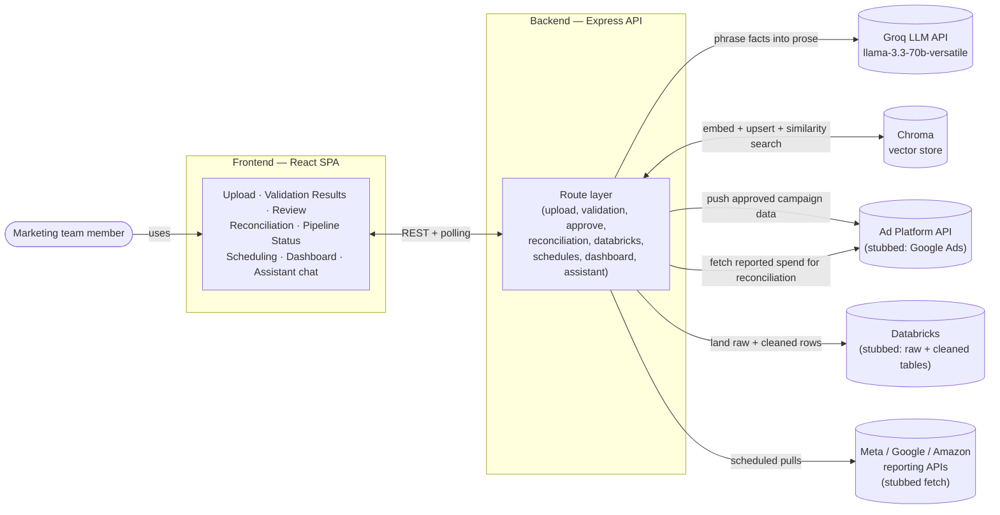
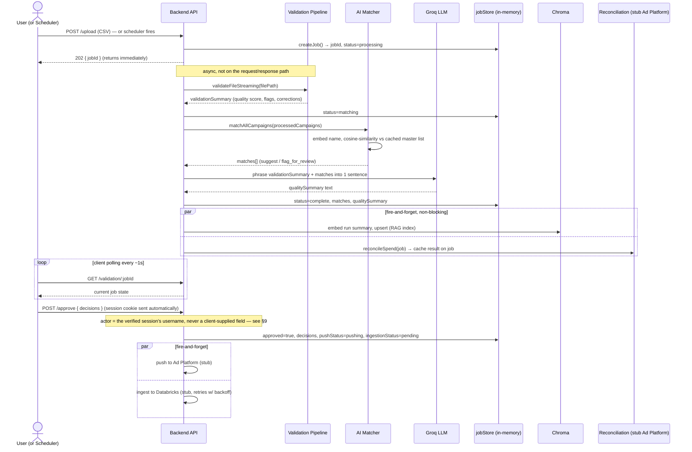
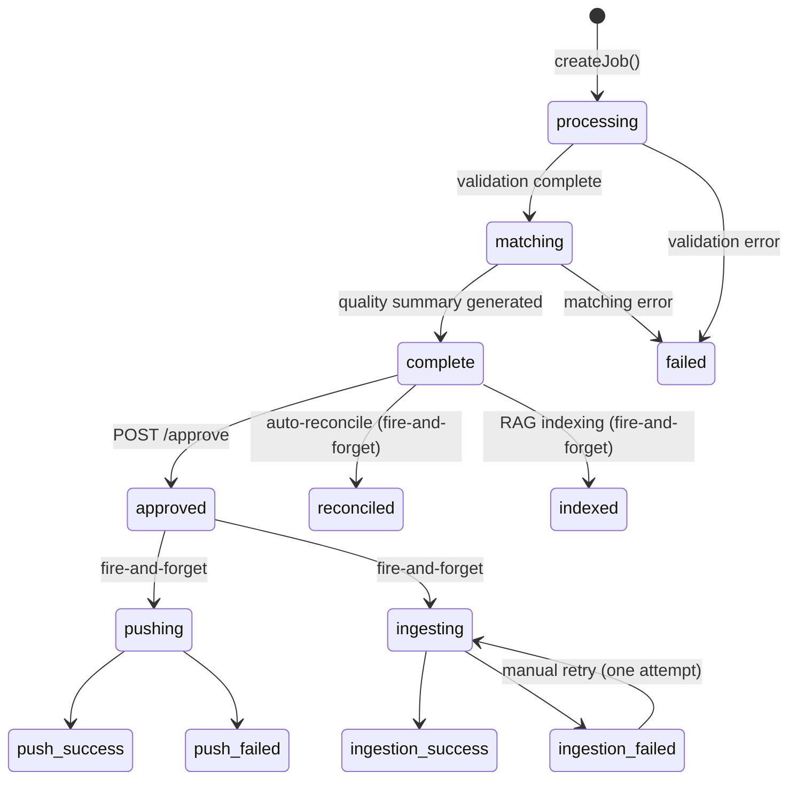

# High-Level Design — Marketing Data Ingestion & RAG Assistant

## 1. What this system is

Marketing teams export campaign performance data from Google, Meta, and Amazon as CSV files with inconsistent formatting — different date formats, inconsistent platform/region spellings, occasional duplicates, occasional garbage rows. This system takes that messy input and turns it into clean, trustworthy, auditable data, while keeping a human in the loop for every judgment call that isn't purely mechanical.

The core design principle, applied consistently everywhere: **deterministic rules handle everything that has a mechanically correct answer; AI is used only for the genuinely fuzzy parts (matching a misspelled campaign name, answering a free-form question) — and even then, AI never gets to invent facts or apply a change on its own.** Every AI output in this system is either a *suggestion awaiting human approval* or *prose describing numbers computed elsewhere*. This distinction shows up in almost every architectural decision below, so it's worth stating up front.

A user uploads a CSV (or a schedule triggers one automatically) → the file is validated and normalized row-by-row → an AI matcher suggests corrections for messy campaign names → a human reviews and approves/rejects → approved data is pushed to the ad platform and landed in a warehouse (Databricks, simulated) → everything is queryable afterward through a RAG-based natural-language assistant → all of it rolls up into a dashboard.

---

## 2. Tech stack

| Layer | Choice | Why |
|---|---|---|
| Backend | Node.js + Express | Simple, fast to iterate on for a time-boxed prototype |
| Frontend | React (+ React Router) | Standard SPA, no need for SSR here |
| Job/schedule/audit state | In-memory `Map`/arrays | Prototype-appropriate; explicitly **not** production-durable (see §7) |
| Vector store | Chroma | Needed for real nearest-neighbor search over a *growing* corpus (run summaries) — see §4 for why this is the one place a vector DB earns its keep |
| Embeddings | `Xenova/all-MiniLM-L6-v2`, run **locally** in-process via `@xenova/transformers` | No external embedding API dependency/cost; small model is enough for short marketing text |
| LLM | Groq (`llama-3.3-70b-versatile`) | Fast inference, used only for *phrasing*, never for *computing* |
| CSV parsing | `csv-parse`, streamed via `fs.createReadStream` | Bounded memory regardless of file size |
| File uploads | `multer` → local disk (`uploads/`) | Prototype-appropriate; production equivalent is object storage (see §7) |
| Scheduling | `node-cron` | Lightweight, in-process; documented as the "not Airflow/Prefect yet" choice (see §7) |

---

## 3. System context



**Why this shape:** the frontend never talks to Groq, Chroma, or any external platform directly — every external dependency is mediated by the backend. That keeps API keys server-side only, and keeps every AI call subject to the same grounding discipline (see §5) regardless of which screen triggered it.

---

## 4. Major components

| Component | Responsibility | Key files |
|---|---|---|
| **Upload & validation pipeline** | Streams a CSV, checks structure/types, normalizes known-bad categorical values, standardizes dates, flags duplicates, computes a deterministic quality score | `routes/upload.js`, `services/validation/*` |
| **AI campaign matcher** | Embeds an uploaded campaign name, compares against a cached master list via cosine similarity, returns a suggestion or a "needs human review" flag — **never auto-applies** | `services/ai/matching/*` |
| **AI quality summary** | Turns the validation run's exact computed facts into one human-readable sentence | `services/ai/summary/qualitySummary.js` |
| **RAG assistant** | Answers free-form questions about ingestion history, routed to either an exact-computation path or a vector-retrieval path, both LLM-phrased | `routes/assistant.js`, `services/ai/rag/*` |
| **Review & approval** | Captures a human reviewer's approve/reject decision per suggested match; this decision is the single event that triggers the two downstream side effects below | `routes/approve.js`, `data/auditStore.js` |
| **Ad Platform push** (stub) | Simulates pushing approved campaign performance data back to the ad platform | `services/adtech/adPlatformPush.js` |
| **Spend reconciliation** | Compares uploaded spend against ad-platform-reported spend per campaign, flags variance past a threshold; now runs automatically after every completed job, not just on-demand | `services/adtech/reconciliation.js`, `services/adtech/autoReconcile.js` |
| **Databricks ingestion** (stub) | Lands raw + cleaned data into simulated bronze/silver tables with idempotency and retry-with-backoff | `services/databricks/databricksIngestion.js`, `data/databricksStore.js` |
| **Scheduling** | Per-source cron configuration (hourly/daily/weekly/manual), triggers the same ingestion pipeline programmatically, records run history, notifies on failure | `services/scheduler/*`, `routes/schedules.js`, `data/scheduleStore.js` |
| **Dashboard** | Aggregates totals, quality trend, reconciliation pass rate, AI correction acceptance rate, RAG query stats, and pipeline latency/health across every run | `routes/dashboard.js` |
| **Job store** | The one record every other component reads/writes — a job's status, validation results, matches, decisions, push/ingestion/reconciliation outcomes | `data/jobStore.js` |
| **Auth & RBAC** | Login, session verification via an httpOnly JWT cookie, and per-route role checks (uploader / approver / admin) | `routes/auth.js`, `middleware/auth.js`, `services/auth/jwt.js`, `data/userStore.js` — see §9 |
| **Audit log** | Append-only record of every mutation — logins, uploads, approvals, schedule changes, ingestion retries — with the actor always derived from the verified session, never client input | `data/auditStore.js`, `routes/audit.js` — see §9 |

---

## 5. End-to-end data flow: one ingestion run



**Why fire-and-forget for indexing/reconciliation/push/ingestion:** the user's "is my upload done" signal is `status: complete`, which only depends on validation + matching + the quality summary. RAG indexing, reconciliation, the ad-platform push, and Databricks ingestion are all *side effects of* a completed run, not prerequisites for reporting it as done — so none of them block the response the user is actually waiting on. In production this fire-and-forget pattern would become a durable queue (a crash mid-index shouldn't silently lose a run), but the pattern itself — don't block critical-path completion on non-critical-path work — is the right one at any scale.

---

## 6. AI integration points — where, why, and how it's kept honest

| Where | What the AI actually does | Model | Grounding discipline |
|---|---|---|---|
| **Campaign name matching** | Embeds the uploaded name, cosine-compares against ~15 cached master campaign embeddings, returns a confidence score | `Xenova/all-MiniLM-L6-v2` (local) | ≥60% confidence → `suggest`; below → `flag_for_review`. **Never auto-applies** — every suggestion is a pending human decision, enforced all the way through to Databricks ingestion (a rejected suggestion keeps the raw name) |
| **AI Quality Summary** | Phrases already-computed validation facts (correction counts, flag counts, quality score) into one sentence | Groq `llama-3.3-70b-versatile` | Prompt hands the model an exact JSON fact object and instructs it to never invent a number; explicitly told not to call a suggested match "auto-corrected" |
| **RAG — structured queries** ("how many files below 80%?") | Phrases an exact, pre-filtered list of jobs into prose with citations | Groq | `queryJobs()` computes the exact filtered result *first* (deterministic, in `jobStore.js`); the LLM only narrates it and is told to say "no matching runs found" rather than guess |
| **RAG — semantic queries** ("why did the Meta upload fail last week?") | Embeds the question, retrieves top-5 similar run summaries from Chroma, phrases an answer with citations | Xenova (embed) + Groq (generate) | Classic retrieve-then-generate; same "don't invent, say not-found if empty" instruction |
| **Query routing** (structured vs. semantic) | Decides which of the two paths above handles a question | **Regex classifier — deliberately not an LLM call** | A small number of known question shapes (`how many`, `below X%`, `show me all…`) don't need fuzzy reasoning to route correctly, and a wrong route here is cheap to fix with a pattern, not a model |

**The one-line summary of the AI boundary in this system:** *AI decides what a fact probably means (a fuzzy campaign name, a free-form question) or how to phrase a fact into English — it never decides what the fact* is *and it never applies a change unsupervised.*

---

## 7. Scalability tradeoffs — current prototype vs. production

Every one of these is a deliberate, documented choice for a time-boxed prototype, not an oversight. The table states what would change and why, so the seams are visible rather than hidden.

| Concern | Current (prototype) | Production equivalent | Why the change matters at scale |
|---|---|---|---|
| **File storage** | Local disk (`uploads/`), deleted after processing | Object storage (S3/Azure Blob/GCS); browser uploads directly via a pre-signed URL | Local disk ties processing to one server instance and doesn't survive that instance dying mid-job; object storage is durable and shareable across workers |
| **Job/schedule/audit state** | In-memory `Map`s and arrays — reset on every restart, invisible to any other instance | Postgres (or Redis for hot state) | Multi-instance deployment is impossible otherwise: instance B can't see a job instance A created. This also blocks true horizontal scaling of the API tier today |
| **Upload processing** | Synchronous-per-request kickoff, `runJob()` runs in the same Node process that received the HTTP request | A queue (SQS/BullMQ/Kafka) + a separate worker pool | Decouples "accept the file" from "process the file" — lets the API tier stay responsive under load and lets workers scale independently based on queue depth, not request rate |
| **CSV validation** | Streaming parse, one row at a time — already the right pattern | Same pattern, just distributed: a worker reads from object storage and streams | The streaming approach itself doesn't need to change; only *where* it runs does |
| **Campaign-name matching** | Brute-force cosine similarity over ~15 in-memory master vectors — instant at this size | An ANN index (hnswlib/FAISS) once the master list is in the thousands, or move it into Chroma if it needs persistence/multi-instance sharing/metadata filtering | O(n) per lookup is free at n=15 and a real cost at n=10,000+ |
| **Embeddings** | Local transformer model, single process, CPU-bound, no batching | A dedicated embedding service (or hosted embedding API) with request batching and a concurrency limit | Right now every embed call is sequential (`matchAllCampaigns` is deliberately *not* `Promise.all` because there's no network cost to overlap for a local model) — a hosted API changes that calculus entirely and would want concurrency control |
| **Vector store (RAG)** | Single-node Chroma | A managed/replicated vector DB (Pinecone, Weaviate, or pgvector alongside the relational store) | Single-node has no HA and no horizontal read scaling as run history grows into the millions |
| **LLM calls** | Synchronous call per job / per query, no rate limiting | Request queuing, streaming responses to the client, cost/usage monitoring, prompt caching where repeated system prompts allow it | Prevents one slow/blocked LLM call from stalling the whole job pipeline, and puts a ceiling on runaway API cost |
| **Scheduler** | `node-cron` inside the single Node process | A workflow engine (Airflow, Prefect, Temporal) or a single designated "leader" instance | **This is the sharpest edge in the current design**: if the API tier ever runs more than one instance, every instance would independently fire the same cron and double/triple-process the same source. `node-cron` has no built-in leader election. This must be solved *before* horizontally scaling the backend, not after |
| **Ad Platform push / Databricks ingestion** | Simulated network calls with deterministic retry-until-success | Real async job polling, a dead-letter queue instead of dropping a row after max retries, and the same idempotency key (`fileHash + uploadDate`) carried through to the real write | The retry-with-backoff *pattern* here is already production-shaped; only the transport is fake |
| **Audit log** | In-memory array, append-only within the process | A durable, immutable audit table (or the warehouse's own audit log) | Compliance/audit requirements need this to survive restarts and be tamper-evident — an in-memory array satisfies neither |
| **Cross-session job handoff** (e.g. uploader hands a job to an approver) | `sessionStorage.activeJobId` on the frontend — works only within one browser tab, survives a same-tab logout/login but not a new tab or device | A durable jobs table (`uploadedBy`, `status`, timestamps) queried by a real "pending review" list endpoint (`GET /jobs?status=complete&approved=false`) | Approval shouldn't depend on the approver reusing the uploader's browser tab; it should be a query against shared state any authorized session can run from anywhere. This is orthogonal to whether ingestion itself runs sync or via a queue — moving to SQS/Kafka changes *who processes* a job, not *who's allowed to see or approve it*, which is still resolved per-request from the JWT/role exactly as it is today |

---

## 8. Reliability mechanisms already in place

These aren't gaps — they're patterns already implemented that would carry through to a production version unchanged:

- **Idempotency on upload**: `fileHash + uploadDate` (`jobStore.checkIdempotency`) means re-uploading the same file the same day returns the existing job instead of reprocessing — this same key is reused as the Databricks ingestion idempotency key, so the concept is proven end-to-end, not just at the upload boundary.
- **Retry-with-backoff on Databricks writes**: a deterministic simulated failure mode (fails until a cumulative attempt threshold) exercises the exact "auto-retry, then allow one manual retry" flow a real warehouse write needs, with every attempt recorded to the audit log.
- **Fire-and-forget isolated from the critical path**: RAG indexing, reconciliation, ad-platform push, and Databricks ingestion all fail independently of job completion — a Chroma outage doesn't fail an upload; a reconciliation error doesn't block approval.
- **Grounding discipline on every LLM call**: covered in §6 — this is a reliability property as much as an accuracy one, since it's what prevents the assistant from confidently answering with a fabricated number.
- **Failure notification on scheduled runs**: a schedule config carries a `notify: { method, target }` — currently a stubbed email/webhook log line, but the trigger point (a scheduled run's terminal failure) and payload shape are real, so wiring an actual SES/webhook call is a drop-in swap, not a redesign.

---

## 9. Security: authentication, RBAC, secrets, and the audit trail

Three NFRs, one consistent design: **the server is the only thing that decides what's true.** The frontend never enforces access control on its own; it only reflects what the backend already checked, and every mutation's "who did this" comes from a verified session, never from anything the client typed.

### Authentication

```mermaid
sequenceDiagram
    actor Browser
    participant API as Backend API
    participant Users as userStore (bcrypt-hashed)
    participant JWT as jwt.js

    Browser->>API: POST /auth/login { username, password }
    API->>Users: verifyPassword() — bcrypt.compare
    Users-->>API: user { username, role }
    API->>JWT: sign({ username, role }, JWT_SECRET, 8h)
    JWT-->>API: token
    API-->>Browser: Set-Cookie: session=<token>; httpOnly; SameSite=Lax
    Note over Browser: token is never in the response body — JS on the page cannot read it

    Browser->>API: any later request (cookie sent automatically)
    API->>JWT: verifySession(cookie)
    JWT-->>API: { username, role } or null
    alt valid
        API->>API: req.user = session → continue to route/role check
    else invalid/missing
        API-->>Browser: 401 Not authenticated
    end
```

- **Session storage: httpOnly cookie, not localStorage.** This is the load-bearing decision. A token in `localStorage` is readable by any script running on the page — one XSS bug anywhere (including a third-party dependency) is a full session-theft bug. An httpOnly cookie is invisible to `document.cookie` and every other JS API; the browser attaches it automatically and the frontend code never touches the token at all.
- **Passwords are bcrypt-hashed**, never compared or stored in plaintext, even though the accounts themselves are seeded (`data/userStore.js`) rather than self-registered — a prototype-appropriate stand-in for a real user directory or SSO integration, but not an excuse to weaken how the passwords that *do* exist are stored.
- **CSRF is covered by `SameSite=Lax`, not a separate token.** `localhost:5173` and `localhost:3000` are same-site (SameSite compares registrable domain, not port), so the cookie is sent on the frontend's own fetch calls — but `SameSite=Lax` still refuses to attach the cookie to a cross-site POST/PUT/DELETE, which is exactly the request shape a CSRF attack needs. A double-submit CSRF token would be redundant here; it becomes worth adding only if the frontend and API ever live on genuinely different sites.
- **No hardcoded JWT secret.** `services/auth/jwt.js` reads `JWT_SECRET` from the environment; if it's unset, it generates a random secret for that process only and logs a loud warning. The failure mode is safe (every session resets on restart) rather than silent (signing tokens with a secret anyone reading the source also knows).

### Authorization (RBAC)

Three roles — `uploader`, `approver`, `admin` — enforced by `middleware/auth.js`'s `requireAuth` (is this session valid at all) and `requireRole(...)` (is this role allowed here), applied **inside each route file** as `router.use(requireRole(...))` rather than at the top-level mount call. That distinction matters: `app.use('/', someMiddleware, someRouter)` runs `someMiddleware` for *every* request that reaches that line, not just ones that match a route inside `someRouter`, because the mount path `'/'` matches everything as a prefix — gating at the router level avoids accidentally locking out unrelated routes.

| Route(s) | Required role | Rationale |
|---|---|---|
| `POST /auth/login` | none (public) | has to be reachable while logged out |
| `GET /validation, /reconciliation, /pipeline-status, /dashboard, POST /assistant/query` | any authenticated role | read-only or informational — every role needs visibility into run history to do their part |
| `POST /upload` | `uploader`, `admin` | only these roles should be able to kick off a new ingestion run |
| `POST /approve`, `POST /databricks/:id/retry` | `approver`, `admin` | approval and warehouse-recovery actions are the "commits changes" surface — gated to the role whose job that is |
| `/schedules*`, `GET /audit` | `admin` | scheduling automation and the audit trail itself are operational/administrative concerns |

The frontend mirrors this (hiding nav links, redirecting `/scheduling` for a non-admin) purely for UX — a hidden button is not a security control. Every one of the routes above re-checks the role server-side regardless of what the SPA's router decided, so calling the API directly with a non-admin session hits the same 403 a determined user would get by editing React state.

**Job visibility is role-based, not ownership-based.** A job record (`data/jobStore.js`) has no `uploadedBy` field at all, and `GET /validation/:jobId` has no ownership check beyond `requireAuth` — any authenticated role can view any job by ID, and any `approver`/`admin` can approve any job regardless of who uploaded it. This is intentional (approval is a role capability, not tied to who uploaded), but it also means there is currently no "my uploads" filtering and no per-job access control — worth naming as a gap if asked. The one place this shows up concretely: the frontend hands off "which job is in progress" between an uploader's session and an approver's session via `sessionStorage.activeJobId` (`frontend/src/context/JobContext.jsx`), which survives a logout/login *in the same browser tab* but is **not** shared across tabs or devices — a prototype-only mechanism, not a real multi-user handoff (see §7's queue row for the production replacement).

### Secrets management

- `GROQ_API_KEY` and `JWT_SECRET` live in `.env`, loaded via `dotenv`, and are never referenced in source — a repo-wide search for either should only ever find `process.env.X` reads, never a literal value.
- `.env.example` documents every required variable with a placeholder, so a fresh clone knows what to configure without a real secret ever being committed.
- `.gitignore` excludes `.env` (and `uploads/`, `chroma-data/`, `node_modules/`) so this holds once the project actually becomes a git repository, not just as an intention.
- Production equivalent: a real secrets manager (Vault, AWS Secrets Manager, or the platform's own env-var injection at deploy time) instead of a `.env` file on disk — the `.env` approach is fine for local dev, not for a deployed multi-person environment.

### Audit trail

`data/auditStore.js` is an append-only log; `routes/audit.js` (admin-only) exposes it, and `AuditLogPage.jsx` makes it an actual inspectable screen rather than write-only plumbing. What it records: logins (success *and* failure), every upload created (manual or scheduled), every approval, every schedule create/update/delete/manual-trigger, and every Databricks ingestion attempt/retry.

The one correctness fix this closes: `POST /approve` and the Databricks retry endpoint used to accept a free-text `reviewer` field from the request body and log *that* as the actor — trivially spoofable, since anyone could type any name into that field. Both routes now derive `actor` exclusively from `req.user.username`, set by `requireAuth` from the verified session. An audit log that trusts client input for "who did this" isn't an audit log; this is what makes it one.

---

## 10. Job lifecycle



A job accumulates state rather than replacing it — `status`, `pushStatus`, `ingestionStatus`, and `reconciliation` are independent fields on the same job record precisely because these are independent, differently-timed processes reading and writing the same underlying record. This is also why the frontend uses distinct polling loops (`pollJob`, `pollPushStatus`, `pollIngestionStatus`) rather than one — each terminal condition settles at a different time.

---

## 11. Honest gap map

Consistent with this project's own stated philosophy of building fewer things deeply rather than everything shallowly:

| Area | Status |
|---|---|
| Ingestion, validation, campaign matching, RAG assistant, AI quality summary | ✅ Fully built and wired end-to-end |
| Review approve/reject → Ad Platform push → Databricks ingestion → audit trail | ✅ Fully built, transport layers simulated (documented per-file) |
| Scheduling | ✅ Fully built — config, cron execution, run history, failure notification; the *source fetch* is the one simulated piece (no real Meta/Google/Amazon credentials) |
| Dashboard | ✅ Fully built, aggregating real job-store/query-log/reconciliation data |
| Auth / RBAC | ✅ Fully built — login, httpOnly-cookie sessions, three roles enforced server-side on every gated route (see §9). Accounts are seeded demo users, not self-service registration or SSO — the one deliberate shortcut in this subsystem |
| Secrets management | ⚠️ `.env` + `.env.example` + `.gitignore`, no secret ever hardcoded in source — real practice for a local prototype, but still not a real secrets manager (Vault/AWS Secrets Manager) for a deployed environment |
| Observability | ❌ No structured logging, metrics, or tracing beyond `console.log`/`console.error` — the Dashboard's "pipeline health" numbers are the closest thing to APM today, computed from job records rather than real instrumentation |
| Multi-instance safety | ❌ In-memory state and the cron scheduler both assume exactly one backend process (see §7's scheduler note); JWT sessions also reset on restart unless `JWT_SECRET` is pinned in the environment |

---

## 12. Repository map

```
backend/
  app.js                       — Express app wiring, auth gate, route mounting, scheduler boot
  middleware/auth.js            — requireAuth (session verification), requireRole (RBAC)
  data/                        — in-memory stores: jobs, schedules, audit log, users,
                                  query log, Databricks bronze/silver tables
  routes/                      — one file per REST surface (auth, upload, validation,
                                  approve, reconciliation, databricks, schedules,
                                  dashboard, assistant, pipelineStatus, audit)
  services/
    auth/                        — JWT sign/verify (services/auth/jwt.js)
    validation/                — deterministic schema/date/business-rule checks
    ai/matching/                — campaign-name embedding + cosine match
    ai/summary/                 — AI quality summary (Groq)
    ai/rag/                      — query router, structured/semantic handlers, indexer
    ai/embeddings/               — shared local embedding client
    adtech/                      — stubbed ad platform client, push, reconciliation
    databricks/                  — stubbed warehouse ingestion + retry logic
    scheduler/                   — cron registration, source fetch stub, notifier

frontend/
  src/pages/                   — one page per workflow step (Login → Upload → … → Dashboard,
                                  plus admin-only Audit Log)
  src/components/              — shared UI: StatusBadge, MetricCard, ChatWidget, Layout,
                                  RequireAuth/RequireRole (route guards)
  src/api/client.js             — all backend calls in one place (credentials always included)
  src/context/JobContext.jsx    — current jobId, shared across pages
  src/context/AuthContext.jsx   — current user/role, login()/logout()
```

---

## 13. Reading this document alongside the code

Nearly every file referenced above carries its own "why" as a code comment at the point of the decision — this document is the map; the comments are the territory. Where this document and a file comment ever disagree, trust the code comment (it's closer to what actually shipped) and treat the mismatch as something to reconcile.
